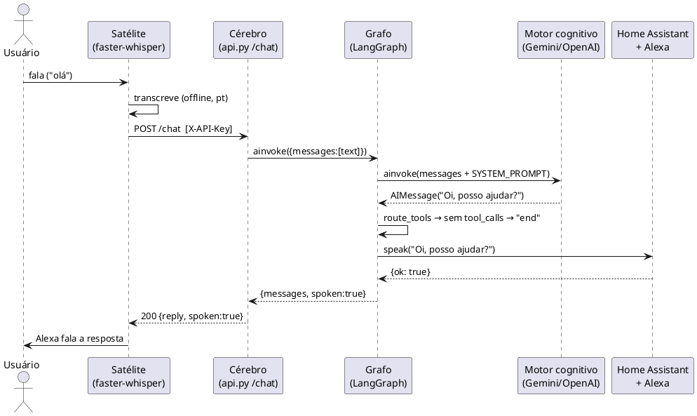
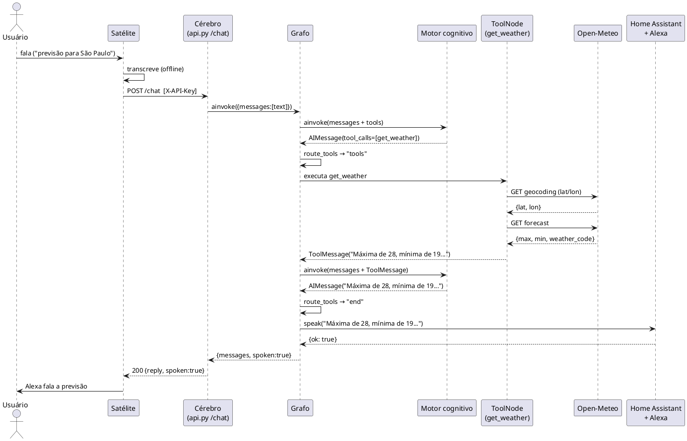
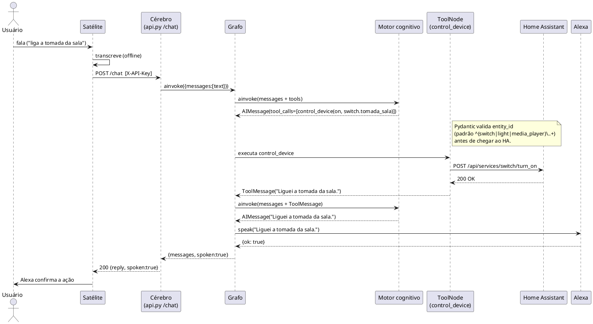
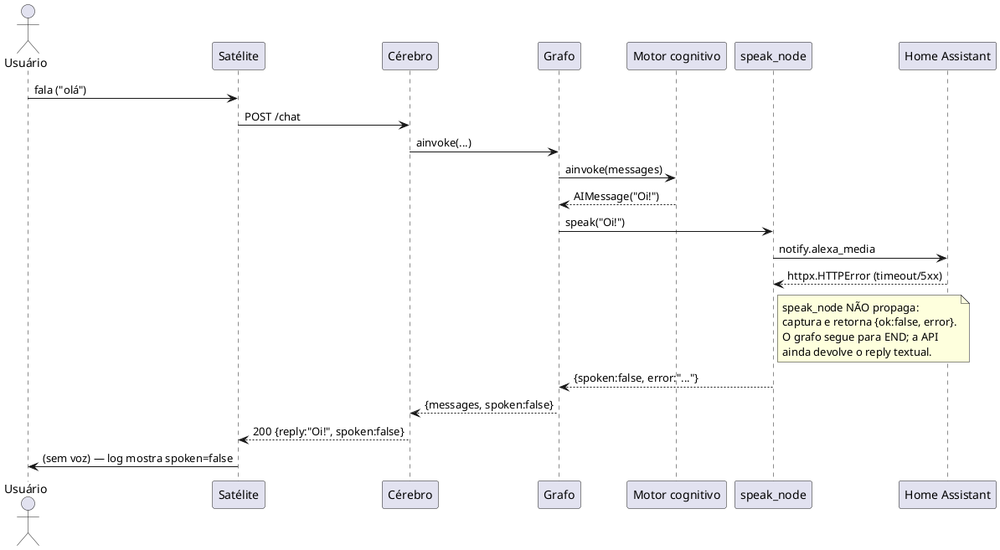

# home-assistent-brain

Orquestrador multi-agente de automação residencial e IA na arquitetura
**Cérebro-Satélite**: um **Cérebro** (FastAPI + LangGraph) que raciocina e
aciona ferramentas, e um **Satélite** (borda local) que captura voz offline
com `faster-whisper` e a envia ao Cérebro. A resposta falada sai pela Alexa
Media Player via Home Assistant.

> O projeto segue o `docs/ROADMAP.md` (Fases 1–5 implementadas), as decisões
> arquiteturais em `docs/adr/` e as diretrizes do `AGENT.md`.

---

## Índice

- [Visão geral](#visão-geral)
- [Arquitetura](#arquitetura)
- [Design e princípios](#design-e-princípios)
- [Componentes](#componentes)
- [Fluxos (diagramas de sequência)](#fluxos-diagramas-de-sequência)
- [Início rápido (start do projeto)](#início-rápido-start-do-projeto)
- [Como rodar os testes](#como-rodar-os-testes)
- [Configuração (`.env`)](#configuração-env)
- [Telegram (canal de texto)](#telegram-canal-de-texto)
- [Estrutura de diretórios](#estrutura-de-diretórios)

---

## Visão geral

| Peça | Tecnologia | Função |
|------|------------|--------|
| **Cérebro** | FastAPI + LangGraph + LangChain | Recebe texto, decide via grafo, aciona ferramentas, devolve resposta falável |
| **Motor cognitivo** | Gemini, OpenAI-compatível ou Ollama local | LLM trocável por configuração (ADR-0001) |
| **Satélite** | `openWakeWord` + `faster-whisper` (CPU/int8) + `sounddevice` | Wake word "hey jarvis" + STT 100% offline, hands-free |
| **Telegram** | `python-telegram-bot` (long polling) | Canal de texto bidirecional, isolado da Alexa |
| **Integração Física** | Home Assistant REST + Alexa Media Player | Controle de dispositivos IoT e síntese de voz (TTS) |
| **Ferramentas** | Open-Meteo, Tavily, Home Assistant | Clima, busca web, automação — expostas ao LLM via `@tool` |

### Fluxo em uma frase

> O usuário fala → o Satélite transcreve offline → envia `POST /chat` ao
> Cérebro → o grafo LangGraph raciocina, aciona ferramentas se preciso → a
> resposta textual é **falada** pela Alexa via Home Assistant.

---

## Arquitetura

```text
                 ┌──────────────────────────────────────────────┐
                 │                   CÉREBRO (api.py)            │
                 │  FastAPI · POST /chat (auth X-API-Key)        │
                 │                                               │
   Satélite  ───▶│  ┌─────────────────────────────────────────┐ │
  (faster-        │  │  StateGraph (LangGraph)                 │ │
   whisper)       │  │  chatbot ─▶ tools ─▶ chatbot ─▶ speak ─▶END │
                  │  │            (loop de tool calls)          │ │
                  │  └─────────────────────────────────────────┘ │
                  │                 │                            │
                  │     motor cognitivo (Gemini/OpenAI)          │
                  └──────────────────┬───────────────────────────┘
                                     │ REST (httpx, timeout)
                                     ▼
                       ┌───────────────────────────┐
                       │   Home Assistant + Alexa   │
                       │  dispositivos IoT · TTS    │
                       └───────────────────────────┘
```

**Por que dois processos?** O Cérebro é orquestração/decisão (servidor,
depende de LLM e rede); o Satélite é borda de áudio (precisa de microfone e
de um modelo Whisper local, sem latência de rede para STT). Separá-los
permite rodar o Cérebro em um host e o Satélite no dispositivo onde o
microfone está.

---

## Design e princípios

- **Motor cognitivo abstraído (ADR-0001):** o LLM nunca é instanciado
  diretamente no grafo. A factory `get_llm()` em `src/config.py` devolve um
  `CognitiveMotor` (Protocol tipado) — trocar Gemini por OpenAI é só
  configuração, sem refatorar o binding do grafo.

- **TTS como nó terminal, não como tool (ADR-0002):** a síntese de voz é um
  **nó obrigatório** ao final do grafo (`speak_node`), não uma `@tool` que o
  LLM pode "esquecer" de chamar. Assim toda resposta é sempre falada; a
  confirmação de ações ("Liguei a tomada") emerge do texto natural do motor.

- **Ferramentas defensivas:** toda `@tool` retorna uma frase falável em caso
  de falha (rede, cidade não encontrada, HA indisponível) — nunca propaga
  exceção ao motor. O usuário sempre ouve algo útil.

- **Design para voz:** o `SYSTEM_PROMPT` é texto **plano, sem Markdown**,
  listas numeradas ou símbolos — porque será falado pela Alexa.

- **Segurança (baseline de 7 itens):**
  1. Zero secrets no código (só `.env` + `.env.example`).
  2. Timeout explícito em todo cliente HTTP (`ha_timeout_s`, `llm_timeout_s`).
  3. Validação de input via Pydantic com constraints em toda `@tool`
     (ex.: `entity_id` só aceita `switch.`, `light.`, `media_player.`).
  4. Auth `X-API-Key` no `POST /chat`.
  5. HA token de longa duração com permissão mínima (documentado no
     `.env.example`).
  6. `gitleaks` no pre-commit (além de ruff/mypy).
  7. `.gitignore` cobre `.env`, `.venv`, caches e modelos Whisper.

- **Tipagem estrita end-to-end:** `mypy --strict` em todo `src/`; `Settings`
  com `extra="forbid"` (rejeita variáveis desconhecidas — protege contra typos).

---

## Componentes

### `src/config.py` — Configuração e motor
- `Settings(BaseSettings)`: leitura estrita do `.env` (`extra="forbid"`).
- `get_settings()`: acesso com cache (`lru_cache`).
- `CognitiveMotor` (Protocol): contrato do LLM, desacopla o grafo do backend.
- `get_llm()`: factory — `gemini`, `openai` ou `ollama`, todos com timeout.

### `src/services/ha_client.py` — Home Assistant + Alexa
- `HomeAssistantClient`: `httpx.AsyncClient` com `base_url`/auth/timeout das
  `Settings`.
- `call_service`, `toggle`, `turn_on`, `turn_off`, `get_state`.
- `speak(text)`: chama `notify.alexa_media` e **não levanta** em falha de TTS
  — retorna `{"ok": False, "error": ...}` (nó do grafo decide o fluxo).

### `src/tools/` — Ferramentas do agente
| Tool | Arquivo | Fonte externa | Saída |
|------|---------|---------------|-------|
| `get_weather` | `weather.py` | Open-Meteo (geocoding + forecast) | frase curta falável |
| `web_search` | `search.py` | Tavily | resposta digerida |
| `control_device` | `home.py` | Home Assistant | confirmação falável |
- `__init__.py` exporta `ALL_TOOLS` (`list[BaseTool]`) — catálogo único p/ o grafo.

### `src/graph/` — O Cérebro (LangGraph)
- `state.py`: `AgentState` (TypedDict) — `messages` (reducer `add_messages`),
  `spoken`, `error`.
- `prompt.py`: `SYSTEM_PROMPT` — texto plano para voz.
- `nodes.py`: `chatbot_node`, `build_tool_node`, `build_speak_node`,
  `route_tools`.
- `workflow.py`: `build_graph(ha_client)` monta `chatbot → (tools → chatbot)*
  → speak → END`.

### `api.py` — Servidor (Cérebro)
- `POST /chat` (auth `X-API-Key`) → `{reply, spoken}`.
- `GET /health` (sem auth).
- Constrói `ha_client` + grafo compilado no `lifespan`.

### `satelite.py` — Satélite (wake word + STT offline)
- `capture_audio()`: escuta o microfone até o wake word "hey jarvis"
  (openWakeWord, ONNX) e grava o comando até ~1 s de silêncio (VAD). Devolve
  uma fala ou `b""` (falso positivo). Única costura com o hardware.
- `_listen(...)`: a máquina de estados ESCUTANDO → GRAVANDO, pura e testável
  (os detectores são injetados).
- `transcribe(audio)`: `faster-whisper` (CPU/int8, `language="pt"`); o modelo é
  carregado uma vez por processo.
- `send_to_brain(text)`: `POST /chat` com header `X-API-Key`.
- `run_once()`: um ciclo (wake word → grava → transcreve → envia).
  `run_forever()` repete indefinidamente; Ctrl+C encerra.

---

## Fluxos (diagramas de sequência)

Os diagramas abaixo seguem a sintaxe **PlantUML**. Renderize em
<https://www.plantuml.com/plantuml/uml/> ou com o plugin PlantUML do seu editor.

### Fluxo 1 — Turno sem ferramentas (resposta direta)



### Fluxo 2 — Turno com ferramenta (ex.: "qual a previsão?")



### Fluxo 3 — Controle de dispositivo (ex.: "liga a tomada da sala")



### Fluxo 4 — Fallback defensivo (ex.: HA indisponível no TTS)



---

## Início rápido (start do projeto)

### Pré-requisitos

- **Python 3.12** (o `faster-whisper`/`av` não compila no 3.14; testado em 3.12).
- `pip` e `git`.
- Para o Satélite: microfone funcional (somente para a captura real).
- (Opcional) Uma instância do **Home Assistant** com token de longa duração e
  o **Alexa Media Player** configurado — sem isso o Cérebro sobe e os testes
  passam, mas o TTS real não funcionará.

### 1. Clone e entre no diretório

```bash
git clone <url-do-repo> home-assistent-brain
cd home-assistent-brain
```

### 2. Crie e ative o ambiente virtual

```bash
python3.12 -m venv .venv
source .venv/bin/activate        # Windows: .venv\Scripts\activate
```

### 3. Instale as dependências e os hooks

```bash
make setup        # equivale a: pip install -e ".[dev]"  &&  pre-commit install
```

> Sem `make`: `pip install -e ".[dev]"` depois `pre-commit install`.

### 4. Configure o ambiente

```bash
cp .env.example .env
# edite .env e preencha as chaves (GEMINI_API_KEY, HA_TOKEN, BRAIN_API_KEY, etc.)
```

Detalhes de cada variável em [Configuração (`.env`)](#configuração-env).

### 5. Inicie o Cérebro (servidor)

```bash
make run-brain    # uvicorn api:app --reload --host 0.0.0.0 --port 8000
```

Valide:

```bash
curl http://localhost:8000/health
# {"status":"ok"}
```

### 6. (Opcional) Inicie o Satélite (captura de voz)

Em outro terminal, com o venv ativo:

Uma vez por dispositivo (precisa de rede), baixe os modelos do openWakeWord —
wake word `hey_jarvis`, modelos de features e o VAD; nada disso vem no pacote:

```bash
.venv/bin/python -c "import openwakeword; openwakeword.utils.download_models(['hey_jarvis'])"
```

Depois, inicie o Satélite:

```bash
make run-satellite   # python satelite.py
# Diga "hey jarvis", espere e fale o comando; ~1 s de silêncio encerra a gravação.
# Ctrl+C encerra.
```

> O Satélite baixará o modelo Whisper (`small` por padrão) na primeira
> execução. Para um start mais rápido, use `WHISPER_MODEL=tiny` no `.env`.
> Se faltar algum modelo do openWakeWord, o Satélite falha ao iniciar com o
> erro do `openwakeword` — rode o comando de download acima.
> Os modelos pré-treinados (inclusive `hey_jarvis`) são CC BY-NC-SA 4.0
> (uso não comercial).

### 7. (Opcional) Teste o `/chat` diretamente

```bash
curl -X POST http://localhost:8000/chat \
  -H "Content-Type: application/json" \
  -H "X-API-Key: $BRAIN_API_KEY" \
  -d '{"text": "qual a previsão para São Paulo?"}'
# {"reply":"Máxima de 28, mínima de 19, pancadas à tarde","spoken":true}
```

### 8. (Opcional) Inicie o bot do Telegram (canal de texto)

O Telegram é um **terceiro canal**, por texto e **isolado** da Alexa: as
mensagens trafegam com `metadata.source="telegram"` e o grafo pula o nó
`speak` — nada é falado em casa. Veja [Telegram (canal de texto)](#telegram-canal-de-texto).

```bash
make run-telegram   # python telegram_bot.py (long polling)
```

---

## Como rodar os testes

O projeto tem **testes unitários por componente** (com `respx` para mockar HTTP)
cobrindo `config`, `ha_client`, `tools`, `graph`, `api` e `satelite`.

### Tudo de uma vez (recomendado)

```bash
make check        # ruff lint + mypy --strict src + pytest
```

### Apenas os testes

```bash
make test         # pytest
# ou, com verbosidade:
pytest -v
```

### Uma unidade específica

```bash
pytest tests/test_ha_client.py     # HomeAssistantClient
pytest tests/test_tools.py         # weather/search/home + schemas
pytest tests/test_graph.py         # speak_node, route_tools, prompt, build_graph
pytest tests/test_api.py           # /health, /chat auth e contrato
pytest tests/test_satelite.py      # _listen (wake word/VAD), transcribe (stub), send_to_brain, loop
pytest tests/test_config.py        # Settings + extra="forbid"
```

### Lint e typecheck isolados

```bash
make lint         # ruff check .
make typecheck    # mypy --strict src
make format       # ruff format . + ruff check --fix .
```

### Pre-commit (lint + typecheck + secrets)

```bash
pre-commit run --all-files
```

> Os testes não dependem de hardware (microfone) nem de serviços externos
> reais: o STT usa um modelo *stub* e todo HTTP é mockado com `respx`.

---

## Configuração (`.env`)

Copie `.env.example` para `.env` e preencha. Resumo:

| Variável | Descrição |
|----------|-----------|
| `LLM_PROVIDER` | `gemini`, `openai` ou `ollama` (ADR-0001) |
| `GEMINI_API_KEY` | Chave do Google Gemini |
| `OPENAI_API_KEY` / `OPENAI_API_BASE` | Backend OpenAI-compatível (use se `LLM_PROVIDER=openai`) |
| `OLLAMA_BASE_URL` / `OLLAMA_MODEL` | Ollama local (padrão: `http://127.0.0.1:11434`, `llama3.2:3b`) |
| `LLM_TIMEOUT_S` | Timeout do motor cognitivo (default `30.0`) |
| `HA_URL` | URL base do Home Assistant |
| `HA_TOKEN` | Token de longa duração com **permissão mínima** (apenas `call_service` para `notify.alexa_media`, `homeassistant` e `switch`/`light`) |
| `HA_TIMEOUT_S` | Timeout do HA (default `5.0`) |
| `ALEXA_MEDIA_ENTITY` | `entity_id` do media_player do Alexa |
| `TAVILY_API_KEY` | Chave da API Tavily (busca web) |
| `BRAIN_API_KEY` | Chave exigida no header `X-API-Key` do `POST /chat` |
| `BRAIN_URL` | Onde o Cérebro escuta (default `http://localhost:8000`) |
| `WHISPER_MODEL` | Tamanho do modelo: `tiny`/`base`/`small`/`medium`/`large-v3` |
| `WAKE_WORD_MODEL` | Modelo de wake word do openWakeWord (opcional, default `hey_jarvis`) |
| `WAKE_WORD_THRESHOLD` | Score 0–1 que dispara a detecção (opcional, default `0.5`) |
| `END_SILENCE_S` | Segundos de silêncio que encerram a gravação (opcional, default `1.0`) |
| `NO_SPEECH_TIMEOUT_S` | Segundos sem fala após o wake word até descartar (opcional, default `5.0`) |
| `MAX_RECORD_S` | Teto da gravação de um comando (opcional, default `15.0`) |
| `TELEGRAM_BOT_TOKEN` | Token do bot criado no BotFather (`/newbot`) |
| `ALLOWED_USERS` | IDs de usuários autorizados, separados por vírgula (`11111,22222`) |

> ⚠️ **Nunca** commite `.env` com valores reais. Ele está no `.gitignore` e o
> `gitleaks` escaneia o repositório no pre-commit.

---

## Telegram (canal de texto)

O Telegram é um **terceiro canal**, por texto e **isolado** das notificações
de voz: mensagens chegam ao Cérebro com `metadata.source="telegram"` e o grafo
termina em `END` **sem** passar pelo nó `speak` — nada é falado pela Alexa.

### Pré-requisitos

1. No Telegram, fale com o [@BotFather](https://t.me/BotFather) e crie um bot
   (`/newbot`). Copie o token recebido.
2. Descubra o seu `user_id`: mande qualquer mensagem ao bot recém-criado e
   olhe o log do bot — ele registra `WARNING unauthorized user_id=...`. (Ou use
   o [@userinfobot](https://t.me/userinfobot).)

### Configuração

Preencha no `.env`:

```ini
TELEGRAM_BOT_TOKEN=123456:ABC...
ALLOWED_USERS=11111,22222
```

### Rodando

```bash
make run-telegram   # python telegram_bot.py (long polling)
```

Mande "qual a previsão do tempo?" pelo Telegram → receba a resposta de texto,
com o indicador "digitando..." visível durante o turno, **sem** aviso na Alexa.
Usuários fora de `ALLOWED_USERS` são ignorados (log `WARNING` no console).

### Contrato do `/chat` (Telegram)

O `metadata.source` controla o roteamento no grafo:

```bash
# Telegram: pula a Alexa (spoken=false, source="telegram")
curl -X POST http://localhost:8000/chat \
  -H "Content-Type: application/json" -H "X-API-Key: $BRAIN_API_KEY" \
  -d '{"text":"clima em cascavel","metadata":{"source":"telegram"}}'
# {"reply":"...","spoken":false,"source":"telegram","metadata":{"tools_used":["get_weather"]}}

# Sem metadata: comportamento de voz (satélite/Alexa, spoken=true) — regressão zero
curl -X POST http://localhost:8000/chat \
  -H "Content-Type: application/json" -H "X-API-Key: $BRAIN_API_KEY" \
  -d '{"text":"clima em cascavel"}'
```

---

## Estrutura de diretórios

```text
home-assistent-brain/
├── .env.example            # Modelo de variáveis de ambiente
├── .gitignore              # Ignora .env, .venv, caches, modelos Whisper
├── .pre-commit-config.yaml # Hooks: ruff, ruff-format, mypy, gitleaks
├── Makefile                # setup/install/format/lint/typecheck/test/run-*/check
├── pyproject.toml          # Deps, ruff, mypy strict, pytest
├── AGENT.md                # Diretrizes de arquitetura
├── CONTEXT.md              # Linguagem ubíqua do domínio
├── api.py                  # Cérebro — FastAPI (POST /chat, GET /health)
├── satelite.py             # Satélite — wake word + faster-whisper STT offline
├── docs/
│   ├── ROADMAP.md          # Plano de implementação (Fases 1–5)
│   └── adr/
│       ├── 0001-llm-motor-abstraido.md
│       └── 0002-tts-como-no-final-do-grafo.md
├── src/
│   ├── __init__.py
│   ├── config.py           # Settings + get_llm() (ADR-0001)
│   ├── graph/
│   │   ├── __init__.py
│   │   ├── state.py        # AgentState (TypedDict)
│   │   ├── prompt.py       # SYSTEM_PROMPT (voz, sem Markdown)
│   │   ├── nodes.py        # chatbot / tool / speak (ADR-0002)
│   │   └── workflow.py     # build_graph()
│   ├── tools/
│   │   ├── __init__.py     # ALL_TOOLS
│   │   ├── weather.py      # Open-Meteo
│   │   ├── search.py       # Tavily
│   │   └── home.py         # Home Assistant (validação de entity_id)
│   └── services/
│       ├── __init__.py
│       └── ha_client.py    # HomeAssistantClient + speak defensivo
└── tests/                  # pytest + respx (uma suite por componente)
    ├── conftest.py
    ├── test_config.py
    ├── test_ha_client.py
    ├── test_tools.py
    ├── test_graph.py
    ├── test_api.py
    └── test_satelite.py
```
